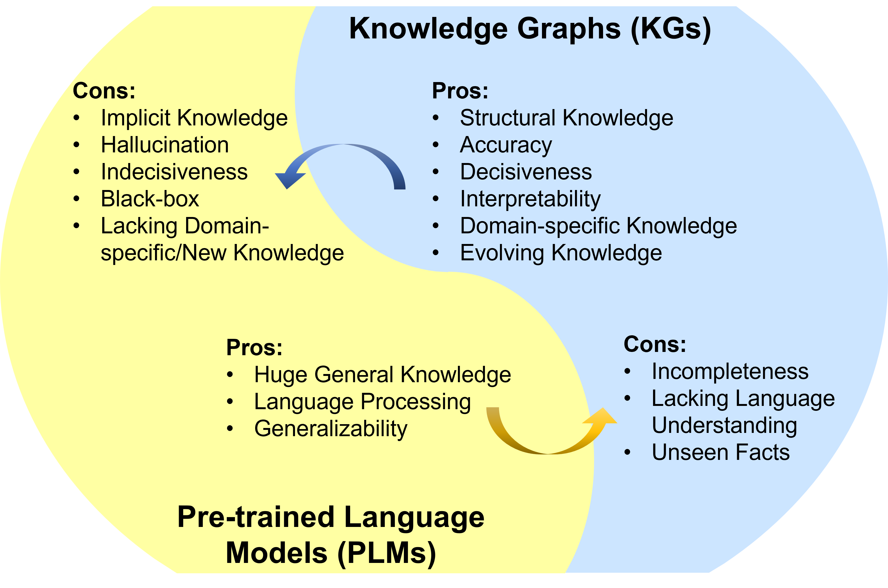
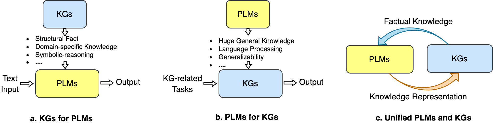
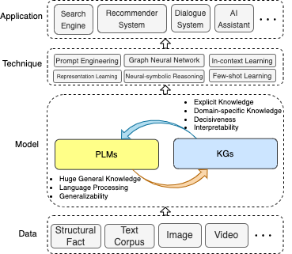

# Awesome-LLM-KG
  [](https://github.com/RManLuo/Awesome-LLM-KG) 
[](https://opensource.org/licenses/MIT)
   
 
 
 

A collection of papers and resources about unifying large language models (LLMs) and knowledge graphs (KGs).

Large language models (LLMs) have achieved remarkable success and generalizability in various applications. However, they often fall short of capturing and accessing factual knowledge. Knowledge graphs (KGs) are structured data models that explicitly store rich factual knowledge. Nevertheless, KGs are hard to construct and existing methods in KGs are inadequate in handling the incomplete and dynamically changing nature of real-world KGs. Therefore, it is natural to unify LLMs and KGs together and simultaneously leverage their advantages.



## News
🔭 This is an under-developing project, you can hit the **STAR** and **WATCH** to follow the updates.
* Our roadmap paper: [Unifying Large Language Models and Knowledge Graphs: A Roadmap](https://arxiv.org/abs/2306.08302) is now public.

## Overview
In this repository, we collect recent advances in unifying LLMs and KGs.  We present a roadmap that summarizes three general frameworks: *1) KG-enhanced LLMs*, *2) LLMs-augmented KGs*, and *3) Synergized LLMs + KGs*.



We also illustrate the involved techniques and applications.



We hope this repository can help researchers and practitioners to get a better understanding of this emerging field.    
If this repository is helpful for you, plase help us by citing this paper:
```bash
@article{llm_kg,
title={Unifying Large Language Models and Knowledge Graphs: A Roadmap},
author={Shirui Pan, Linhao Luo, Yufei Wang, Chen Chen, Jiapu Wang, Xindong Wu},
journal={arXiv preprint arxiv:306.08302},
year={2023}
}
```


## Table of Contents
- [Awesome-LLM-KG](#awesome-llm-kg)
  - [News](#news)
  - [Overview](#overview)
  - [Table of Contents](#table-of-contents)
  - [Related Surveys](#related-surveys)
  - [KG-enhanced LLMs](#kg-enhanced-llms)
    - [KG-enhanced LLM Pre-training](#kg-enhanced-llm-pre-training)
    - [KG-enhanced LLM Inference](#kg-enhanced-llm-inference)
    - [KG-enhanced LLM Interpretability](#kg-enhanced-llm-interpretability)
  - [LLM-augmented KGs](#llm-augmented-kgs)
    - [LLM-augmented KG Embedding](#llm-augmented-kg-embedding)
    - [LLM-augmented KG Completion](#llm-augmented-kg-completion)
    - [LLM-augmented KG-to-Text Generation](#llm-augmented-kg-to-text-generation)
    - [LLM-augmented KG Question Answering](#llm-augmented-kg-question-answering)
  - [Synergized LLMs + KGs](#synergized-llms--kgs)
    - [Knowledge Representation](#knowledge-representation)
    - [Reasoning](#reasoning)
  - [Applications](#applications)
    - [Recommendation](#recommendation)
## Related Surveys

* Unifying Large Language Models and Knowledge Graphs: A Roadmap (Arxiv, 2023) [[paper]](https://arxiv.org/pdf/2306.08302.pdf)
* A Survey on Knowledge-Enhanced Pre-trained Language Models (Arxiv, 2023) [[paper]](https://arxiv.org/pdf/2212.13428.pdf)
* A Survey of Knowledge-Intensive NLP with Pre-Trained Language Models (Arxiv, 2022) [[paper]](https://arxiv.org/pdf/2202.08772.pdf)
* A Review on Language Models as Knowledge Bases (Arxiv, 2022) [[paper]](https://arxiv.org/pdf/2204.06031.pdf)
* Generative Knowledge Graph Construction: A Review (Arxiv, 2022) [[paper]](https://arxiv.org/pdf/2210.12714.pdf)
* Knowledge Enhanced Pretrained Language Models: A Compreshensive Survey (Arxiv, 2021) [[paper]](https://arxiv.org/pdf/2110.08455.pdf)
* Reasoning over Different Types of Knowledge Graphs: Static, Temporal and Multi-Modal (Arxiv, 2022) [[paper]](https://arxiv.org/abs/2212.05767)[[code]](https://github.com/LIANGKE23/Awesome-Knowledge-Graph-Reasoning)

## KG-enhanced LLMs
### KG-enhanced LLM Pre-training
- ERNIE: Enhanced Language Representation with Informative Entities (ACL, 2019) [[paper]](https://aclanthology.org/P19-1139.pdf)
- Exploiting structured knowledge in text via graph-guided representation learning (EMNLP, 2019) [[paper]](https://aclanthology.org/2020.emnlp-main.722.pdf)
- SKEP: Sentiment knowledge enhanced pre-training for sentiment analysis (ACL, 2020) [[paper]](https://aclanthology.org/2020.acl-main.374.pdf)
- E-bert: A phrase and product knowledge enhanced language model for e-commerce (Arxiv, 2020) [[paper]](https://arxiv.org/pdf/2009.02835.pdf)
- Pretrained encyclopedia: Weakly supervised knowledge-pretrained language model (ICLR, 2020) [[paper]](https://openreview.net/pdf?id=BJlzm64tDH)
- BERT-MK: Integrating graph contextualized knowledge into pre-trained language models (EMNLP, 2020) [[paper]](https://aclanthology.org/2020.findings-emnlp.207.pdf)
- K-BERT: enabling language representation with knowledge graph (AAAI, 2020) [[paper]](https://ojs.aaai.org/index.php/AAAI/article/view/5681/5537)
- CoLAKE: Contextualized language and knowledge embedding (COLING, 2020) [[paper]](https://aclanthology.org/2020.coling-main.327.pdf)
- Kepler: A unified model for knowledge embedding and pre-trained language representation (TACL, 2021) [[paper]](https://aclanthology.org/2021.tacl-1.11.pdf)
- K-Adapter: Infusing Knowledge into Pre-Trained Models with Adapters (ACL Findings, 2021) [[paper]](https://aclanthology.org/2021.findings-acl.121.pdf)
- Cokebert: Contextual knowledge selection and embedding towards enhanced pre-trained language models (AI Open, 2021) [[paper]](https://www.sciencedirect.com/science/article/pii/S2666651021000188/pdfft?md5=75919f85dcb5711fd2fe9e3785b24982&pid=1-s2.0-S2666651021000188-main.pdf)
- Ernie 3.0: Large-scale knowledge enhanced pre-training for language understanding and generation (Arixv, 2021) [[paper]](https://arxiv.org/pdf/2107.02137)
- Pre-training language models with deterministic factual knowledge (EMNLP, 2022) [[paper]](https://aclanthology.org/2022.emnlp-main.764.pdf)
- Kala: Knowledge-augmented language model adaptation (NAACL, 2022) [[paper]](https://aclanthology.org/2022.naacl-main.379.pdf)
- DKPLM: decomposable knowledge-enhanced pre-trained language model for natural language understanding (AAAI, 2022) [[paper]](https://ojs.aaai.org/index.php/AAAI/article/view/21425/21174)
- Dict-BERT: Enhancing language model pre-training with dictionary (ACL Findings, 2022) [[paper]](https://aclanthology.org/2022.findings-acl.150.pdf)
- JAKET: joint pre-training of knowledge graph and language understanding (AAAI, 2022) [[paper]](https://ojs.aaai.org/index.php/AAAI/article/view/21417/21166)

### KG-enhanced LLM Inference
- Barack’s wife hillary: Using knowledge graphs for fact-aware language modeling (ACL, 2019) [[paper]](https://aclanthology.org/P19-1598.pdf)
- Retrieval-augmented generation for knowledge-intensive nlp tasks (NeurIPS, 2020) [[paper]](https://proceedings.neurips.cc/paper_files/paper/2020/file/6b493230205f780e1bc26945df7481e5-Paper.pdf)
- Realm: Retrieval-augmented language model pre-training (ICML, 2020) [[paper]](https://dl.acm.org/doi/pdf/10.5555/3524938.3525306)
- QA-GNN: Reasoning with language models and knowledge graphs for question answering (NAACL, 2021) [[paper]](https://aclanthology.org/2021.naacl-main.45.pdf)
- Memory and knowledge augmented language models for inferring salience in long-form stories (EMNLP, 2021) [[paper]](https://aclanthology.org/2021.emnlp-main.65.pdf)
- JointLK: Joint reasoning with language models and knowledge graphs for commonsense question answering (NAACL, 2022) [[paper]](https://aclanthology.org/2022.naacl-main.372.pdf)
- Greaselm: Graph reasoning enhanced language models (ICLR, 2022) [[paper]](https://openreview.net/pdf?id=41e9o6cQPj)
- An efficient memory-augmented transformer for knowledge-intensive NLP tasks (EMNLP, 2022) [[paper]](https://aclanthology.org/2022.emnlp-main.346.pdf)
- Knowledge-Augmented Language Model Prompting for Zero-Shot Knowledge Graph Question Answering (NLRSE@ACL, 2023) [[paper]](https://arxiv.org/abs/2306.04136)

### KG-enhanced LLM Interpretability
- Language models as knowledge bases (EMNLP, 2019) [[paper]](https://arxiv.org/pdf/1909.01066.pdf)
- Knowledge neurons in pretrained transformers (Arxiv, 2021) [[paper]](https://arxiv.org/pdf/2104.08696.pdf)
- Kagnet: Knowledge-aware graph networks for commonsense reasoning (Arxiv, 2019) [[paper]](https://arxiv.org/pdf/1909.02151.pdf)
- QA-GNN: Reasoning with language models and knowledge graphs for question answering (ACL, 2021) [[paper]](https://arxiv.org/pdf/2104.06378.pdf)
- How can we know what language models know? (ACL, 2020) [[paper]](https://direct.mit.edu/tacl/article/doi/10.1162/tacl_a_00324/96460)
- Autoprompt: Eliciting knowledge from language models with automatically generated prompts (Arxiv, 2020) [[paper]](https://arxiv.org/pdf/2010.15980.pdf)
- How to Query Language Models? (Arxiv, 2021) [[paper]](https://arxiv.org/pdf/2108.01928.pdf)
- Rewire-then-probe: A contrastive recipe for probing biomedical knowledge of pre-trained language models (Arxiv, 2021) [[paper]](https://arxiv.org/pdf/2110.08173.pdf)
- When Not to Trust Language Models: Investigating Effectiveness and Limitations of Parametric and Non-Parametric Memories (Arxiv, 2022) [[paper]](https://arxiv.org/pdf/2212.10511.pdf)
- Interpreting language models through knowledge graph extraction (Arxiv, 2021) [[paper]](https://arxiv.org/pdf/2111.08546.pdf)
- How Pre-trained Language Models Capture Factual Knowledge? A Causal-Inspired Analysis (Arxiv, 2022) [[paper]](https://arxiv.org/pdf/2203.16747.pdf)
- Can Language Models be Biomedical Knowledge Bases? (EMNLP, 2021) [[paper]](https://arxiv.org/pdf/2109.07154.pdf)

## LLM-augmented KGs
### LLM-augmented KG Embedding
- LambdaKG: A Library for Pre-trained Language Model-Based Knowledge Graph Embeddings (Arxiv, 2023) [[paper]](https://arxiv.org/pdf/2210.00305.pdf)
- Integrating Knowledge Graph embedding and pretrained Language Models in Hypercomplex Spaces (Arxiv, 2022) [[paper]](https://arxiv.org/pdf/2208.02743.pdf)
- Endowing Language Models with Multimodal Knowledge Graph Representations (Arxiv, 2022) [[paper]](https://arxiv.org/abs/2206.13163)
- Language Model Guided Knowledge Graph Embeddings (IEEE Access, 2022) [[paper]](https://ieeexplore.ieee.org/stamp/stamp.jsp?tp=&arnumber=9831788)
- Language Models as Knowledge Embeddings (IJCAI, 2022) [[paper]](https://www.ijcai.org/proceedings/2022/0318.pdf)
- Pretrain-KGE: Learning Knowledge Representation from Pretrained Language Models (EMNLP, 2020) [[paper]](https://aclanthology.org/2020.findings-emnlp.25.pdf)
- KEPLER: A Unified Model for Knowledge Embedding and
Pre-trained Language Representation (TACL, 2020) [[paper]](https://arxiv.org/pdf/1911.06136.pdf)

### LLM-augmented KG Completion
- KG-BERT: BERT for knowledge graph completion (Arxiv, 2019) [[paper]](http://arxiv.org/abs/1909.03193)
- Multi-task learning for knowledge graph completion with pre-trained language models (COLING, 2020) [[paper]](https://doi.org/10.18653/v1/2020.coling-main.153)
- Do pre-trained models benefit knowledge graph completion? A reliable evaluation and a reasonable approach (ACL, 2022) [[paper]](https://doi.org/10.18653/v1/2022.findings-acl.282)
- Joint language semantic and structure embedding for knowledge graph completion (COLING, 2022) [[paper]](https://aclanthology.org/2022.coling-1.171)
- MEM-KGC: masked entity model for knowledge graph completion with pre-trained language model (IEEE Access, 2021) [[paper]](https://doi.org/10.1109/ACCESS.2021.3113329)
- Knowledge graph extension with a pre-trained language model via unified learning method (Knowl. Based Syst., 2023) [[paper]](https://doi.org/10.1016/j.knosys.2022.110245)
- Structure-augmented text representation learning for efficient knowledge graph completion (WWW, 2021) [[paper]](https://doi.org/10.1145/3442381.3450043)
- Simkgc: Simple contrastive knowledge graph completion with pre-trained language models (ACL, 2022) [[paper]](https://doi.org/10.18653/v1/2022.acl-long.295)
- Lp-bert: Multi-task pre-training knowledge graph bert for link prediction (Arxiv, 2022) [[paper]](https://arxiv.org/abs/2201.04843)
- From discrimination to generation: Knowledge graph completion with generative transformer (WWW, 2022) [[paper]](https://doi.org/10.1145/3487553.3524238)
- Sequence-to-sequence knowledge graph completion and question answering (ACL, 2022) [[paper]](https://doi.org/10.18653/v1/2022.acl-long.201)
- Knowledge is flat: A seq2seq generative framework for various knowledge graph completion (COLING, 2022) [[paper]](https://aclanthology.org/2022.coling-1.352)
- A framework for adapting pre-trained language models to knowledge graph completion (EMNLP, 2022) [[paper]](https://aclanthology.org/2022.emnlp-main.398)
- Dipping plms sauce: Bridging structure and text for effective knowledge graph completion via conditional soft prompting (ACL, 2023) [[paper]]()
### LLM-augmented KG-to-Text Generation
- GenWiki: A dataset of 1.3 million content-sharing text and graphs for unsupervised graph-to-text generation  (COLING, 2020) [[paper]](https://aclanthology.org/2020.coling-main.217.pdf)
- KGPT: Knowledge-grounded pre-training for data-to-text generation (EMNLP 2020) [[paper]](https://aclanthology.org/2020.emnlp-main.697.pdf)
- JointGT: Graph-text joint representation learning for text generation from knowledge graphs (ACL Findings, 2021) [[paper]](https://aclanthology.org/2021.findings-acl.223.pdf)
- Investigating pretrained language models for graph-to-text generation (NLP4ConvAI, 2021) [[paper]](https://aclanthology.org/2021.nlp4convai-1.20.pdf)
- Few-shot knowledge graph-to-text generation with pretrained language models (ACL, 2021) [[paper]](https://aclanthology.org/2021.findings-acl.136.pdf)
- GAP: A graph-aware language model framework for knowledge graph-to-text generation (COLING, 2022) [[paper]](https://aclanthology.org/2022.coling-1.506.pdf)

### LLM-augmented KG Question Answering

- UniKGQA: Unified Retrieval and Reasoning for Solving Multi-hop Question Answering Over Knowledge Graph (ICLR, 2023) [[paper]](https://arxiv.org/abs/2212.00959)
- StructGPT: A General Framework for Large Language Model to Reason over Structured Data (Arxiv, 2023) [[paper]](https://arxiv.org/abs/2305.09645)
- An Empirical Study of GPT-3 for Few-Shot Knowledge-Based VQA (AAAI, 2022) [[paper]](https://ojs.aaai.org/index.php/AAAI/article/view/20215)
- An Empirical Study of Pre-trained Language Models in Simple Knowledge Graph Question Answering (World Wide Web Journal, 2023) [[paper]](https://arxiv.org/abs/2303.10368)
- Empowering Language Models with Knowledge Graph Reasoning for Open-Domain Question Answering (EMNLP, 2022) [[paper]](https://aclanthology.org/2022.emnlp-main.650.pdf)
- DRLK: Dynamic Hierarchical Reasoning with Language Model and Knowledge Graph for Question Answering (EMNLP, 2022) [[paper]](https://aclanthology.org/2022.emnlp-main.342/)
- Subgraph Retrieval Enhanced Model for Multi-hop Knowledge Base Question Answering (ACL, 2022) [[paper]](https://aclanthology.org/2022.acl-long.396.pdf)
- GREASELM: GRAPH REASONING ENHANCED LANGUAGE MODELS FOR QUESTION ANSWERING (ICLR, 2022) [[paper]](https://openreview.net/pdf?id=41e9o6cQPj)
- QA-GNN: Reasoning with Language Models and Knowledge Graphs for Question Answering (NAACL, 2021) [[paper]](https://aclanthology.org/2021.naacl-main.45/)


## Synergized LLMs + KGs
### Knowledge Representation
* Pre-training language model incorporating domain-specific heterogeneous knowledge into a unified representation (Expert Systems with Applications, 2023) [[paper]](https://www.sciencedirect.com/science/article/pii/S0957417422023879)
* Deep Bidirectional Language-Knowledge Graph
Pretraining (NIPS, 2022) [[paper]](https://arxiv.org/abs/2210.09338)
* KEPLER: A Unified Model for Knowledge Embedding and Pre-trained Language Representation (TACL, 2021) [[paper]](https://aclanthology.org/2021.tacl-1.11.pdf)
* JointGT: Graph-Text Joint Representation Learning for Text Generation from Knowledge Graphs (ACL 2021) [[paper]](https://aclanthology.org/2021.findings-acl.223/)
### Reasoning
* A Unified Knowledge Graph Augmentation Service for Boosting
Domain-specific NLP Tasks (Arxiv, 2023) [[paper]](https://arxiv.org/pdf/2212.05251.pdf)
* Unifying Structure Reasoning and Language Model Pre-training
for Complex Reasoning (Arxiv, 2023) [[paper]](https://arxiv.org/pdf/2301.08913.pdf)
* Complex Logical Reasoning over Knowledge Graphs using Large Language Models (Arxiv, 2023) [[paper]](https://arxiv.org/abs/2305.01157)
## Applications

### Recommendation
* RecInDial: A Unified Framework for Conversational Recommendation with Pretrained Language Models (Arxiv, 2023) [[paper]](https://arxiv.org/pdf/2110.07477.pdf)
